# Architecture

## High-Level Overview

Fincept Terminal is a monorepo with:

- Shared Python libraries under `libs/`.
- Async Python services under `services/`.
- A FastAPI gateway under `services/api`.
- A Next.js operator dashboard under `apps/dashboard`.
- Local infrastructure in `docker-compose.yml`.
- Specification and planning docs under `spec/` and `docs/`.
- Proof and helper scripts under `scripts/`.

The architecture is event-driven. Market data, signals, decisions, orders,
fills, positions, and alerts move through Redis Streams. Timescale/Postgres
stores historical data and auditable records. Redis also stores fast state,
heartbeats, leadership locks, rate-limit state, and dashboard-facing snapshots.
Model artifacts and prediction logs are filesystem-backed under `models/` and
`data/predictions/`.

```mermaid
flowchart LR
  venues["Venue/public data adapters"] --> ingestor["services/ingestor"]
  ingestor --> db["Postgres/Timescale"]
  ingestor --> md["Redis Streams md.*"]
  md --> features["services/features"]
  features --> online["Redis online feature store"]
  features --> offline["Parquet offline features"]
  online --> agents["services/agents"]
  agents --> sig["Redis Streams sig.*"]
  sig --> orchestrator["services/orchestrator"]
  orchestrator --> decisions["ord.decisions"]
  orchestrator --> intents["ord.orders"]
  intents --> risk["services/risk"]
  risk --> oms["services/oms"]
  oms --> fills["ord.fills"]
  fills --> portfolio["services/portfolio"]
  portfolio --> positions["ord.positions / Redis state"]
  positions --> api["services/api FastAPI"]
  api --> dashboard["apps/dashboard Next.js"]
  api --> control["operator controls"]
```

## Main Runtime Components

| Component | Path | Role |
|---|---|---|
| Core contracts | `libs/fincept-core` | Pydantic schemas, events, settings, IDs, clocks, logging, strategy config, prediction logs. |
| Event bus | `libs/fincept-bus` | Redis Streams producer, consumer, stream names, idempotency and consumer behavior. |
| Data layer | `libs/fincept-db` | SQLAlchemy async engine, models, Alembic migrations, bars/ticks/features/audit helpers. |
| Tool registry | `libs/fincept-tools` | Typed, audit-aware data, research, analytics, and paper-execution tools. |
| SDK | `libs/fincept-sdk` | Strategy SDK and read-oriented developer surface. |
| Ingestor | `services/ingestor` | Venue adapters, normalizer, writer, quality monitor, EOD equity loader. |
| Feature service | `services/features` | Point-in-time transforms, online Redis store, offline Parquet store, feature publication. |
| Agents | `services/agents` | GBM, regime, sentiment, information enrichment, news-alpha, and news-impact agent modules. |
| Orchestrator | `services/orchestrator` | Prediction consensus, allocation, decision and order-intent creation. |
| Risk | `services/risk` | Pre-trade checks, kill-switch awareness, exposure and limit guardrails. |
| OMS | `services/oms` | Paper fills, Alpaca paper adapter, order state, price lookup, fill publication. |
| Portfolio | `services/portfolio` | Fill consumption, position rollup, P&L state. |
| API | `services/api` | FastAPI REST/WebSocket gateway, auth, research routes, model lifecycle, controls. |
| Dashboard | `apps/dashboard` | Next.js operator UI backed by the FastAPI client in `src/lib/api.ts`. |

## Frontend, Backend, and Service Boundaries

Confirmed hard boundaries:

- Dashboard renders and calls API; business rules live in Python services.
- API exposes read models and explicit controls; it should not silently mutate
  trading state outside control endpoints.
- Agents emit predictions and signals; they do not submit orders directly.
- Orchestrator creates decisions and order intents; risk and OMS remain
  separate gates.
- OMS owns order lifecycle and fills; portfolio owns positions.

Evidence: `spec/ARCHITECTURE.md`, `services/api/src/api/main.py`, `services/agents/src/agents/__init__.py`, and the service package layout.

## Storage, Database, and Cache Usage

| Storage | Evidence | Usage |
|---|---|---|
| Postgres/Timescale | `docker-compose.yml`, `libs/fincept-db` | Bars, ticks, provider data, features, audit-oriented records. |
| Redis | `docker-compose.yml`, `libs/fincept-bus`, service pyprojects | Streams, online state, heartbeats, locks, rate limits, health history. |
| MinIO | `docker-compose.yml` | Intended S3-compatible artifact/blob store. Current usage appears less central than filesystem artifacts. |
| Filesystem `models/` | `services/api/src/api/routes/models.py`, `services/agents/gbm_predictor` | Model artifacts, active/shadow promotion pointers, training metadata. |
| Filesystem `data/` | `fincept_core.prediction_log`, feature docs, reports | Prediction logs, feature Parquet, local generated data. |
| Filesystem `strategies/` | `fincept_core.strategy_config` | Strategy config JSON and history JSONL. |
| Filesystem `reports/` | scripts and receipts | Paper-spine, route-smoke, OpenBB live proof, walk-forward reports. |

## External APIs and Integrations

Confirmed or configured:

- Binance, Coinbase, Kraken public crypto market data adapters.
- Alpaca paper trading and market-data integration.
- OpenBB research/provider gateway.
- Exa research tools.
- NewsAPI plus OpenAI/Anthropic-backed sentiment flows.
- FRED macro data for regime agent.
- yfinance/Polygon-style EOD equity loader path.
- GitHub Actions CI and gitleaks secret scanning.

## Authentication and Security Model

Current auth:

- FastAPI uses HS256 bearer JWTs in `services/api/src/api/auth.py`.
- `FINCEPT_JWT_SECRET` comes from `fincept_core.config.Settings`.
- The dev default is `dev-only-change-me`.
- Dashboard stores the token in `localStorage` via `apps/dashboard/src/lib/auth.ts`.

Current security posture:

- Reasonable for localhost/internal prototype use.
- Not enough for production or multi-user operation.
- State-changing routes generally depend on `require_user`, and feature-launch
  routes additionally restrict caller host to localhost/testclient.
- CORS is open to local dashboard dev origins only in code, but production
  origin management is still a future task.

## Background Workers, Queues, Agents, and Schedulers

Confirmed:

- Long-running services are async Python workers.
- Redis Streams are the queue/event backbone.
- API lifespan starts `AlpacaScheduler`, `NewsScheduler`, and a heartbeat task.
- Agents include active and optional/key-gated services.
- `strategy_host` supervises enabled strategy configs.
- `jobs` is intended for cron-style work.

## Config and Environment Variables

Primary config is `fincept_core.config.Settings`, using:

- Prefix: `FINCEPT_`
- Env file: `.env`
- Important defaults: `TRADING_MODE=paper`, `REDIS_URL=redis://127.0.0.1:6379/0`,
  `ALPACA_BASE_URL=https://paper-api.alpaca.markets`, `OMS_ROUTER=sim`,
  `JWT_SECRET=dev-only-change-me`.

The repo has `.env.example`; `.env` is present locally but ignored by git and
was not inspected in this audit.

## Deployment and Runtime Model

Confirmed local model:

- `docker-compose.yml` runs Timescale/Postgres, Redis, and MinIO.
- `scripts/start.ps1`, `scripts/status.ps1`, and `scripts/stop.ps1` are Windows
  helpers for local service orchestration.
- `Makefile` provides POSIX/WSL equivalents.
- API local default is port `8010`; dashboard local default is port `3000`.

Planned/inferred:

- `docs/SYSTEM_OVERVIEW.md` and `spec/ARCHITECTURE.md` discuss Kubernetes
  staging/prod, leader-elected singleton services, and higher-availability
  infrastructure, but no `infra/k8s/` tree was observed in this audit.
