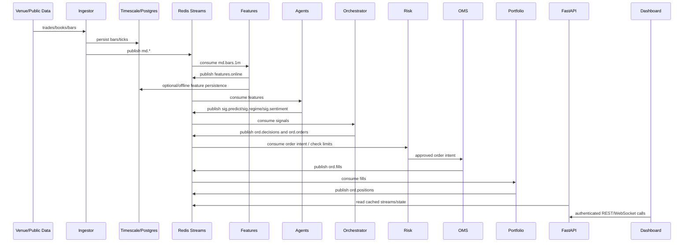
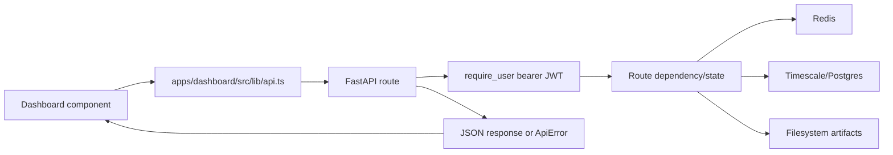

# Data Flow

## Market Data to Paper Trading Flow

## Inputs

External inputs:

- Crypto market data from Binance, Coinbase, and Kraken adapters.
- Equity/EOD data via yfinance/Polygon-style loader paths.
- Alpaca market data and paper-broker data when credentials exist.
- NewsAPI, FRED, Exa, OpenBB, OpenAI, and Anthropic when configured.
- User/operator API requests from the dashboard.
- Local files such as Parquet bars, model artifacts, strategy configs, and
  generated reports.

Internal inputs:

- Redis Streams events.
- Timescale/Postgres records.
- Redis state and heartbeats.
- Filesystem artifacts under `models/`, `data/`, `strategies/`, and `reports/`.

## Processing Steps

1. Ingestor adapters normalize external payloads into shared schemas.
2. `fincept-bus` publishes event envelopes to Redis Streams.
3. Feature workers compute point-in-time features and update online/offline stores.
4. Agents consume features or external information and emit signals/predictions.
5. Orchestrator combines predictions into decisions and order intents.
6. Risk gate approves, rejects, or blocks order intents.
7. OMS simulates paper fills or uses the configured Alpaca paper path.
8. Portfolio service consumes fills and updates position state.
9. API exposes read models and explicit controls.
10. Dashboard renders state and sends authenticated commands.

## Outputs

- Redis Stream events: market data, signals, decisions, orders, fills,
  positions, alerts.
- Timescale/Postgres persisted market-data and audit records.
- Redis online state for UI and services.
- Model artifacts and promotion pointers under `models/`.
- Prediction logs under `data/predictions/`.
- Strategy config JSON and history JSONL under `strategies/`.
- Proof receipts under `reports/`.
- Dashboard views and WebSocket updates.

## API Request/Response Flow

Important contracts:

- Dashboard client uses `NEXT_PUBLIC_API_URL`, defaulting to
  `http://localhost:8010`.
- Most routes require `Authorization: Bearer <jwt>`.
- `/health` is public for liveness.
- API errors should be structured enough for dashboard panels to distinguish
  auth failures from degraded dependencies.

## File Handling

Known file flows:

- Backtest route accepts `bars_path` and synchronously runs a backtest.
- Model routes read/write model artifacts, active/shadow pointers, training
  run metadata, and prediction records.
- Strategy config store reads/writes JSON plus history JSONL.
- Scripts write proof receipts under `reports/`.
- Dashboard server route for portfolio reports reads prompt/context files and
  calls LLM providers when keys are set.

Risk note:

- Any operator-provided path must be resolved and constrained to approved roots.
  Some tests cover unsafe IDs and model-name traversal; `backtest/run` still
  accepts a path after `Path(body.bars_path).exists()`, so root restriction
  should be tightened before broader use.

## State Management

Backend state:

- Redis for streams, heartbeats, rate limits, latest marks, feature state, and
  control state.
- Database for bars, ticks, provider data, features, and audit-oriented state.
- Filesystem for models, predictions, strategy configs, reports.

Frontend state:

- Zustand stores JWT auth token in localStorage.
- TanStack Query handles API fetching/refetching.
- WebSocket client handles live updates with reconnect logic.

## Error Handling Paths

Confirmed patterns:

- `require_user` returns 401 for missing/invalid bearer tokens.
- Data routes wrap some datastore failures in 503 public error envelopes.
- OpenBB routes return structured unavailable states when backend/package is not
  available.
- Feature launcher routes return 403 for non-local callers and 409 for preflight
  blockers.
- Paper-spine receipt records risk-approved and risk-rejected branches.

Known gaps:

- Some errors still include raw exception detail when debug mode is enabled.
- `/data/coverage` had a latest smoke timeout instead of a bounded 200/503.
- Backtest route runs synchronously in the request path and may need queueing
  for larger runs.
