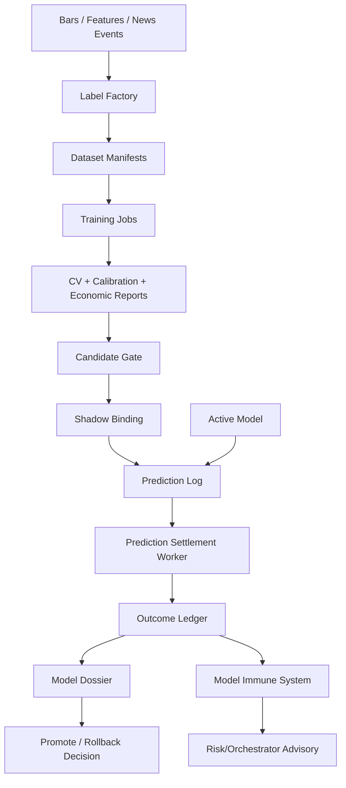

# ML Improvement Report

Date: 2026-06-01

Audience: Fincept developers, quant/ML reviewers, and future coding agents.

Scope: This report focuses on the ML side of Fincept Terminal: feature
engineering, labels, model evaluation, model lifecycle, predictive agents,
shadow deployment, and plausible frontier designs. It does not recommend live
capital deployment. Every proposal should stay paper/shadow-first until it has
receipts.

## Executive Summary

Fincept already has a credible ML spine for an MVP: LightGBM directional
training, purge-aware walk-forward validation, online feature lookup, hot-loaded
active/shadow models, prediction JSONL logs, model API routes, and dashboard
surfaces. That is the right skeleton.

The biggest ML improvement is not "add a bigger model." It is to close the
scientific proof loop:

1. Make labels, feature availability, and evaluation impossible to leak future
   information.
2. Calibrate every model probability and trade only when uncertainty is narrow
   enough.
3. Score models by paper-trading economics, not only AUC.
4. Add settlement/outcome logs so active and shadow predictions can be judged
   automatically.
5. Promote frontier models only through shadow comparison against the existing
   GBM baseline.

The best near-term upgrade is a **model evaluation ledger**: every prediction
gets joined to realized forward returns, risk decision, order/fill outcome, and
portfolio impact. Once that ledger exists, proven methods and cutting-edge
models can compete on the same scoreboard.

## Current ML State

### Confirmed Strengths

| Area | Current evidence | Why it matters |
|---|---|---|
| Baseline model | `services/agents/src/agents/gbm_predictor/train.py` trains LightGBM. | Strong tabular baseline; fast enough for repeated walk-forward testing. |
| Anti-leakage CV | GBM trainer supports walk-forward folds, purge bars, and embargo bars. | Correct direction for financial labels with overlapping horizons. |
| Live inference | `gbm_predictor/infer.py` reads online features and emits `Prediction`. | Keeps model runtime small and testable. |
| Hot reload | `gbm_predictor/main.py` polls active pointers and swaps models without restart. | Allows operator promotion without stopping the process. |
| Shadow mode | Shadow loop records predictions but has no Redis producer parameter. | Strong guardrail: shadow predictions cannot reach orchestrator by accident. |
| Prediction log | `fincept_core.prediction_log` records model-name, symbol, direction, confidence. | Foundation for outcome evaluation. |
| Model API | `services/api/src/api/routes/models.py` exposes models, runs, active/shadow, predictions, stats, and feature importance. | Good operator visibility. |
| News-alpha gate | `news_alpha_predictor/evaluate.py` has policy thresholds for rows, val rows, AUC, age, and active delta. | Early governance pattern for candidate models. |
| Paper-spine receipt | `reports/paper-spine/latest.json` proves deterministic data -> feature -> signal -> decision -> risk -> order -> fill -> portfolio. | Gives a place to hook model evidence to trading evidence. |

### Main ML Gaps

| Gap | Impact | Best fix |
|---|---|---|
| No settlement ledger for predictions | Cannot measure hit rate, Brier score, calibration, realized return, or trade attribution by model. | Add `PredictionOutcomeStore` and settlement worker. |
| AUC is too central | AUC can improve while PnL worsens after costs, capacity, slippage, or poor calibration. | Add economic gates: expected value, net return, drawdown, turnover, hit rate by confidence bucket. |
| Feature-name compatibility defaults | `gbm_predictor/features.py` can default missing long-window/book features to 0.0. Good for demos, risky for production scoring. | Log missing/defaulted feature counts and block promotion if live feature availability is below threshold. |
| Training input path boundary | Model/backtest routes accept server-side file paths; this is risky and can weaken reproducibility. | Restrict to approved data roots and write dataset manifests. |
| Shadow predictions are recorded but not judged | Shadow mode is safe, but not yet a promotion engine. | Compare active vs shadow on settled outcomes and paper-spine-like trade impact. |
| No explicit model card / dossier | Operators cannot quickly see dataset window, label definition, leakage controls, feature availability, and approval status. | Add model dossiers generated from `meta.json`, reports, and outcomes. |

## Principles for ML Work

1. **Forecast tradable outcomes, not vibes.** Directional accuracy alone is not
   enough. Every model must face costs, delay, risk limits, and fill behavior.

2. **Event time beats wall-clock convenience.** Labels, features, and news
   events must be evaluated using `ts_event` and `available_at_ns`, never
   after-the-fact timestamps.

3. **A model is not live until it wins in shadow.** New models can publish to
   logs, not `STREAM_SIG_PREDICT`, until promotion gates pass.

4. **Calibrated confidence is a trading primitive.** The orchestrator and risk
   layer use `direction` and `confidence`; uncalibrated confidence is a position
   sizing bug.

5. **Every frontier idea needs a boring baseline.** TimesFM, Chronos, Moirai,
   TabPFN, LLM event models, and graph models should compete against LightGBM,
   linear/logistic baselines, and no-trade policies.

## Proven Methods to Add First

### 1. Prediction Settlement Ledger

Goal: Join each prediction to realized future returns and optional trade impact.

Design:

- Add a store under `libs/fincept-core` or `services/agents` for settled
  prediction outcomes.
- For each prediction row, compute realized return at its horizon using
  point-in-time bar data.
- Record:
  - `prediction_id`
  - `agent_id`
  - `model_name`
  - `symbol`
  - `ts_event`
  - `horizon_ns`
  - `direction`
  - `confidence`
  - `realized_return`
  - `correct_direction`
  - `brier_component` if binary probability is available
  - `cost_adjusted_return_if_traded`
  - `joined_order_id` when orchestrator acted
  - `fill_id` when OMS filled

Why it is proven:

- It converts ML from "trained model exists" into measurable forecast and
  trading outcomes.
- It makes active-vs-shadow comparison objective.

Where to implement:

- `fincept_core.prediction_log`
- `services/api/src/api/routes/models.py`
- `services/agents/src/agents/gbm_predictor/main.py`
- `services/backtester/src/backtester`
- New tests under `libs/fincept-core/tests` and `services/api/tests`.

Validation:

- Fixture with known bars and predictions settles deterministically.
- API exposes hit rate, Brier score, calibration buckets, mean realized return,
  and coverage by model.

### 2. Probability Calibration and Reliability Diagrams

Goal: Make `confidence` mean what the orchestrator thinks it means.

Current state:

- `GBMPredictor._predict()` maps `prob_up` to `direction = 2p - 1` and
  `confidence = abs(direction)`.
- That is simple and useful, but only safe if `prob_up` is calibrated.

Upgrade:

- Add calibration splits inside walk-forward training.
- Store calibration parameters in `meta.json`.
- Report:
  - reliability table by confidence bucket
  - expected calibration error
  - Brier score and log loss
  - calibration drift over time
- Support Platt/sigmoid and isotonic calibration as first implementations.

Why it is proven:

- Reliability diagrams and calibrated probabilities are standard for
  probabilistic classifiers. scikit-learn documents the interpretation clearly:
  predictions near 0.8 should be positive about 80% of the time.

Where to implement:

- `services/agents/src/agents/gbm_predictor/train.py`
- `services/api/src/api/routes/models.py`
- dashboard model detail page.

Validation:

- Unit test on synthetic probabilities.
- Regression fixture showing calibration metadata in `meta.json`.
- Dashboard typecheck for the model dossier panel.

### 3. Triple-Barrier Labels and Meta-Labeling

Goal: Replace simple forward-return sign labels with labels that encode trade
reality.

Current state:

- GBM label is sign of forward return after `horizon_bars`.
- This is a clean baseline, but it ignores stop-loss/take-profit path and
  holding-time dynamics.

Upgrade:

- Build labels from three exits:
  - upper profit barrier
  - lower loss barrier
  - vertical time barrier
- Add meta-labeling:
  - primary model proposes side
  - meta-model predicts whether taking that side is worth risk/cost

Why it is proven:

- This is a widely used financial ML pattern because it handles path-dependent
  outcomes and lets the second model learn "when not to trade."

Where to implement:

- `services/backtester/src/backtester/gbm_features.py`
- `services/agents/src/agents/gbm_predictor/train.py`
- new `services/agents/src/agents/labels.py`

Validation:

- Fixture where take-profit, stop-loss, and vertical barrier each win once.
- Walk-forward report includes label distribution by fold.

### 4. Purged, Embargoed, Grouped Walk-Forward CV

Goal: Upgrade current purge/embargo into a reusable evaluator across all agents.

Current state:

- GBM trainer has purge and embargo parameters.
- Backtester has a separate walk-forward implementation.

Upgrade:

- Extract a common splitter/evaluator package.
- Support:
  - expanding windows
  - rolling windows
  - symbol-grouped splits
  - event-overlap purging
  - embargo after validation windows
  - regime-aware fold summaries

Why it is proven:

- Financial labels often overlap in time; naive random CV leaks. The repo
  already recognizes this with purge bars.

Where to implement:

- `services/backtester/src/backtester/walk_forward.py`
- `services/agents/src/agents/gbm_predictor/train.py`
- new `libs/fincept-core` or `services/agents` splitter utility.

Validation:

- Unit tests for overlap removal.
- Golden fold layout fixture.

### 5. Economic Model Gates

Goal: Promote models based on economics and risk, not only classification stats.

Add gates:

- Minimum out-of-sample net return after costs.
- Maximum drawdown limit.
- Turnover ceiling.
- Hit rate by confidence decile.
- Calibration error ceiling.
- Minimum trade count.
- No single symbol contributes more than a threshold of edge.
- Shadow model must beat active model by a statistically meaningful margin.

Where to implement:

- `services/agents/src/agents/news_alpha_predictor/evaluate.py`
- equivalent `gbm_predictor/evaluate.py`
- `services/api/src/api/routes/models.py`
- dashboard model detail.

Validation:

- Candidate with high AUC but bad net return is rejected.
- Candidate with too few trades is rejected.

### 6. Feature Availability and Drift Monitor

Goal: Treat missing, defaulted, stale, and shifted features as first-class model
risks.

Current risk:

- `load_live(... allow_compat_defaults=True)` can default several features to
  0.0 so old artifacts keep producing predictions.

Upgrade:

- Count missing/defaulted features by symbol/model.
- Store live feature distribution snapshots.
- Compare live distributions to training distributions from `meta.json`.
- Block promotion if live feature coverage is below threshold.
- Alert if population stability index or z-score drift breaches thresholds.

Where to implement:

- `services/features`
- `services/agents/src/agents/gbm_predictor/features.py`
- `services/api/src/api/routes/models.py`
- dashboard system/model panels.

Validation:

- Test that a model with missing strict features does not predict.
- Test that defaulted-feature count appears in prediction logs or health output.

## Model Families Worth Adding

### A. Keep LightGBM as the Champion Baseline

LightGBM remains the right baseline for tabular market features:

- It is fast.
- It handles nonlinear interactions.
- It is easy to evaluate in walk-forward loops.
- It has a published efficiency foundation using GOSS and EFB.

Improvements:

- Add calibrated probability wrappers.
- Add feature importance sidecar with gain and split.
- Add monotonic constraints only where there is real domain conviction.
- Add a second objective for expected return regression, not only direction.
- Add LambdaRank/ranking mode for cross-sectional stock selection.

### B. Linear and Logistic Baselines

Add boring baselines:

- Logistic regression on the same features.
- Elastic-net regression for expected return.
- Simple momentum/mean-reversion rules.
- No-trade policy.

Why:

- If a fancy model cannot beat a transparent baseline after costs, it should not
  be promoted.

### C. Regime-Specialized Experts

Add separate models per regime:

- high volatility
- low volatility
- trending
- mean-reverting
- risk-off
- event/news-driven

Use `regime_agent` and realized market state to gate expert weights.

### D. Conformal Risk Wrappers

Use conformal prediction around model outputs:

- For regression: interval around expected return.
- For classification: prediction sets or abstention when uncertainty is too high.
- For trading: do not trade when the conformal interval overlaps zero after
  cost.

This is especially attractive because conformal methods can wrap LightGBM,
foundation models, or news models.

### E. Cross-Sectional Ranking Models

Instead of predicting each symbol independently, predict relative ranking:

- Which symbols are likely to outperform the universe over the next horizon?
- Which signals survive sector/market beta neutrality?
- Which candidates deserve limited gross exposure?

Where it plugs in:

- New agent emits ranked predictions.
- Orchestrator converts rank/score to target weights.
- Risk caps gross, sector, and concentration exposure.

## Cutting-Edge and First-of-Its-Kind Designs

These are deliberately more speculative. None should publish live signals until
they pass shadow gates against the LightGBM baseline.

### 1. Foundation-Model Shadow Bench

Concept:

Run multiple pretrained time-series/tabular foundation models as shadow agents:

- TimesFM for quantile forecasts.
- Chronos for probabilistic forecasts.
- Moirai for multivariate/cross-frequency forecasting.
- TabPFN for small-data tabular experiments or per-regime few-shot classifiers.

Design:

```text
features.online / bars
  -> foundation_model_adapter
  -> ForecastDistribution
  -> calibration + conformal wrapper
  -> shadow PredictionLog only
  -> settlement ledger
  -> active-vs-shadow dashboard
```

Why it could be special:

- Fincept can compare foundation models against a live paper-trading spine, not
  only benchmark forecasting errors.
- The key output should be a tradable distribution: quantiles, uncertainty, and
  abstention, not just point forecasts.

Risks:

- Many foundation models are trained on broad time series, not necessarily
  tradable financial microstructure.
- Zero-shot forecast quality may not survive costs.
- GPU/runtime footprint may not fit always-on services.

Safe first slice:

- Build offline adapters only.
- Score historical bars and write shadow predictions.
- No Redis publish path.

### 2. Event-Causal Market Memory

Concept:

Create an event memory that links news, filings, macro prints, model signals,
orders, fills, and realized outcomes into a graph.

Design:

- Nodes:
  - event
  - symbol
  - source
  - regime
  - prediction
  - order/fill
  - outcome
- Edges:
  - mentions
  - similar_to
  - occurred_under_regime
  - preceded_return
  - contradicted_by_price_action
- Models:
  - graph embeddings for similar-event retrieval
  - causal-impact estimates per event type
  - LLM summaries constrained to graph evidence

Why it could be first-of-kind for this repo:

- The paper-spine receipt can become the "ground truth trace" for every event.
- News-impact and information-enricher agents already create the right raw
  material.

Safe first slice:

- Store graph snapshots as local JSONL/Parquet.
- Only expose read-only analog retrieval in the dashboard.

### 3. Conformal Trade Gate

Concept:

Every model produces a distribution or uncertainty interval. The gate decides:

- trade
- shrink size
- shadow only
- abstain

Rule:

```text
if lower_bound_after_cost > 0:
    allow long candidate
elif upper_bound_after_cost < 0:
    allow short candidate
else:
    abstain
```

Why it could be powerful:

- It turns uncertainty into an operational control surface.
- It can wrap all model families uniformly.
- It directly reduces churn from uncertain predictions.

Where it plugs in:

- Between `ConsensusBuilder` and `target_notional`.
- Or as a risk pre-check before OMS.

### 4. Alpha Immune System

Concept:

A meta-agent that looks for model failure modes, not alpha:

- calibration drift
- feature drift
- regime mismatch
- crowding/correlation breakdown
- stale data
- shadow model underperformance
- anomalous turnover
- drawdown clusters

Output:

- `ModelHealthSignal`
- `ReduceRiskSignal`
- `DisableModelRecommendation`

Why it is novel:

- Most trading systems promote models; fewer systems continuously adversarially
  audit them with the same seriousness as alpha generation.

Safe first slice:

- Read-only dashboard panel using existing predictions, features, and receipts.
- No automatic disable action until human approval.

### 5. Generative Scenario Forge

Concept:

Generate market scenarios for stress testing agents:

- volatility jumps
- liquidity gaps
- delayed news availability
- exchange outage
- correlated selloff
- false-positive event burst
- regime shift halfway through a fold

Model options:

- Simple bootstrapped/block-resampled scenarios first.
- Later: diffusion or transformer scenario generator trained on historical
  sequences.

Where it plugs in:

- Backtester fixture generation.
- Paper-spine replay variants.
- Risk gate stress tests.

The first-of-kind version:

- Scenarios are generated with explicit causal annotations:
  "news shock -> spread widens -> model confidence spikes -> risk shrinks size."
- Each scenario produces a receipt, not just a synthetic price path.

### 6. Agent Debate With Proof Receipts

Concept:

LLM or non-LLM agents do not directly trade. They debate a structured thesis:

- bull evidence
- bear evidence
- data quality objections
- risk objections
- required falsification test

The judge agent can only output:

- research note
- shadow signal
- no-op

No order path.

Why it could work here:

- `fincept-tools` already has typed/audit-aware tool concepts.
- Dashboard favors structured operator rails over free-form chat.

Safe first slice:

- Add "investment committee packet" for one symbol using only read-only tools.
- Store evidence hashes and source URLs.
- Compare debate recommendations to later returns in the settlement ledger.

## Proposed ML Target Architecture



## Recommended Roadmap

### P0: Make Current ML Measurable

1. Add prediction settlement ledger.
2. Add calibration and economic metrics to model reports.
3. Add approved-root validation for model/backtest input paths.
4. Add feature availability logging for GBM live inference.
5. Add a model dossier endpoint and dashboard card.

Exit criteria:

- Every active/shadow model has settled hit rate, calibration buckets, Brier
  score, mean realized return, and cost-adjusted return.
- Candidate promotion can fail for bad economics even if AUC passes.

### P1: Improve Labels and Validation

1. Add triple-barrier labels.
2. Add meta-labeling.
3. Extract shared purged/embargoed CV utilities.
4. Add regime-aware fold summaries.
5. Add cross-sectional ranking evaluation.

Exit criteria:

- Model reports show label distribution, fold stability, regime breakdown, and
  economic results.

### P2: Add Better Baselines and Ensembles

1. Add logistic/elastic-net baselines.
2. Add expected-return regression models.
3. Add ranker models for cross-sectional allocation.
4. Add calibrated ensemble combiner.
5. Replace linear confidence sizing with confidence plus uncertainty sizing.

Exit criteria:

- Orchestrator can consume multiple calibrated model families without inflating
  confidence just because more agents exist.

### P3: Frontier Shadow Lab

1. Add offline adapters for TimesFM, Chronos, Moirai, and TabPFN.
2. Run all foundation models as shadow-only benchmarks.
3. Add event-causal memory graph for news and outcomes.
4. Add conformal trade gate.
5. Add alpha immune system.
6. Add scenario forge.

Exit criteria:

- Frontier models produce receipts and settled outcomes.
- No frontier model can reach `STREAM_SIG_PREDICT` without passing shadow gates.

## Concrete First Tasks

### Task 1: PredictionOutcomeStore

- Add append/read/stats APIs.
- Store JSONL first, matching `PredictionLog`.
- Add route: `GET /models/{name}/outcomes`.
- Add dashboard card: settled outcomes by confidence bucket.

### Task 2: Calibration Report Sidecar

- Add `calibration.json` next to `model.txt` and `meta.json`.
- Include reliability buckets, ECE, Brier score, log loss.
- Add warning in model listing when absent.

### Task 3: Feature Health Sidecar

- During inference, count missing/defaulted features per prediction cycle.
- Record `feature_health` rows.
- Add dashboard warning when predictions rely on compatibility defaults.

### Task 4: CandidateGatePolicy v2

- Extend news-alpha gate pattern to GBM.
- Add fields:
  - `min_brier_improvement`
  - `max_ece`
  - `min_net_return`
  - `max_drawdown`
  - `min_shadow_observations`
  - `max_feature_default_rate`

### Task 5: Foundation Model Offline Benchmark

- Add a `services/agents/foundation_forecasters/` experimental package.
- First implementation should not publish to Redis.
- It should read a fixed historical fixture and emit comparable prediction
  JSONL rows.

## What Not to Do Yet

- Do not replace LightGBM with a large model before outcome settlement exists.
- Do not connect news-impact signals to order flow before calibration and
  shadow reports exist.
- Do not use LLM-generated theses as direct trading signals.
- Do not add online learning until drift detection and rollback are reliable.
- Do not let any experimental model publish to `STREAM_SIG_PREDICT`.
- Do not optimize for AUC without cost-adjusted return and drawdown.

## Reference Notes

These references were used to anchor the method recommendations:

- LightGBM: "LightGBM: A Highly Efficient Gradient Boosting Decision Tree",
  NeurIPS 2017. https://papers.nips.cc/paper/6907-lightgbm-a-highly-efficient-gradient-boosting-decision-tree
- scikit-learn probability calibration documentation.
  https://scikit-learn.org/stable/modules/calibration.html
- Sequential Predictive Conformal Inference for Time Series.
  https://arxiv.org/abs/2212.03463
- TimesFM repository and paper pointers.
  https://github.com/google-research/timesfm
- Chronos: Learning the Language of Time Series.
  https://arxiv.org/abs/2403.07815
- Moirai: Unified Training of Universal Time Series Forecasting Transformers.
  https://arxiv.org/abs/2402.02592
- TabPFN Nature paper: Accurate predictions on small data with a tabular
  foundation model. https://www.nature.com/articles/s41586-024-08328-6
