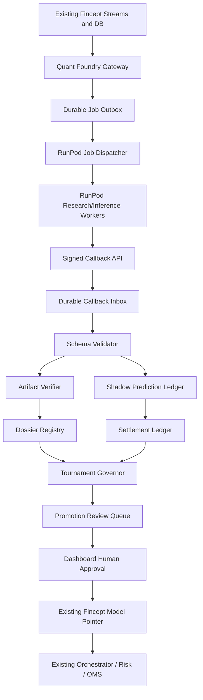

# Fincept Quant Foundry Connectivity and Module Development Design

Status: draft for user review  
Date: 2026-06-21  
Companion spec: `docs/superpowers/specs/2026-06-21-fincept-quant-foundry-design.md`  
Goal: define how Fincept Quant Foundry connects to the existing system smoothly and reliably, and how each module should be developed in a safe build order.

## 1. Core Connectivity Principle

Quant Foundry should make Fincept smarter without making Fincept fragile.

"Always works" should mean:

- If RunPod is healthy, Fincept can train, shadow-score, evaluate, and rank models continuously.
- If RunPod is slow, Fincept queues work and keeps local services running.
- If RunPod is down, Fincept falls back to local models, local receipts, and existing shadow lanes.
- If a callback is duplicated, Fincept processes it once.
- If an artifact is corrupt, Fincept rejects it before registration.
- If a model is excellent in research but bad live, the Tournament Governor blocks promotion.
- If a model reaches live/paper workflows, it still passes through existing Fincept orchestrator, risk, and OMS boundaries.

The platform should use an **at-least-once transport with exactly-once effects**:

- jobs and callbacks may be retried;
- every operation has an idempotency key;
- side effects are stored once;
- model artifacts are hash-verified;
- promotion state changes are explicit and auditable.

## 2. Existing Fincept System Boundaries

Quant Foundry should connect through the current system boundaries instead of bypassing them.

Existing event streams in `libs/fincept-bus/src/fincept_bus/streams.py`:

- `md.trades`
- `md.books`
- `md.bars.1m`
- `features.online`
- `info.raw`
- `info.enriched`
- `sig.predict`
- `sig.sentiment`
- `sig.regime`
- `sig.news_impact`
- `ord.decisions`
- `ord.orders`
- `ord.fills`
- `ord.positions`
- `events.alerts`

Important existing schemas in `libs/fincept-core/src/fincept_core/schemas.py`:

- `BarEvent`
- `FeatureFrame`
- `InformationEvent`
- `Prediction`
- `SentimentSignal`
- `RegimeSignal`
- `Decision`
- `OrderIntent`
- `RiskCheckResult`
- `Position`
- `AlertEvent`

Existing hard boundary:

- `sig.predict` can feed the existing orchestrator/decision path.
- `ord.orders` feeds OMS/risk-controlled order handling.
- Quant Foundry should not write either stream until a model is approved for the relevant promotion level.
- Shadow RunPod predictions should go to a separate Quant Foundry shadow ledger or a new shadow-only stream, not directly to `sig.predict`.

## 3. Recommended Connection Pattern

Use a hub-and-spoke pattern:



### Why this pattern

- RunPod never talks directly to Redis streams that affect trading.
- Fincept can retry jobs without duplicate side effects.
- Fincept can reject bad artifacts before they become model records.
- Every external response becomes a durable callback record before processing.
- Dashboard and API can display pending, retrying, failed, stale, and complete states.

## 4. Smooth Connectivity Requirements

### 4.1 Durable job outbox

Every outbound RunPod job should be stored before dispatch.

Fields:

- `job_id`
- `job_type`
- `idempotency_key`
- `status`
- `request_payload_hash`
- `request_payload_ref`
- `created_at`
- `scheduled_at`
- `dispatched_at`
- `completed_at`
- `attempt_count`
- `next_retry_at`
- `runpod_endpoint_id`
- `runpod_job_id`
- `timeout_seconds`
- `priority`
- `budget_cents`
- `error_code`
- `error_summary`

Statuses:

- `queued`
- `dispatching`
- `dispatched`
- `running`
- `callback_received`
- `validating`
- `completed`
- `failed_retryable`
- `failed_terminal`
- `canceled`
- `expired`

### 4.2 Durable callback inbox

Every callback from RunPod should be stored before domain processing.

Fields:

- `callback_id`
- `job_id`
- `idempotency_key`
- `signature_valid`
- `payload_hash`
- `payload_ref`
- `received_at`
- `processed_at`
- `status`
- `schema_version`
- `error_code`
- `error_summary`

Statuses:

- `received`
- `signature_rejected`
- `schema_rejected`
- `stored`
- `processed`
- `duplicate`
- `failed_retryable`
- `failed_terminal`

### 4.3 Idempotency

Every cross-boundary operation needs one stable idempotency key:

```text
qf:<job_type>:<dataset_id>:<model_family>:<config_hash>:<attempt_group>
```

Rules:

- Re-dispatching the same job reuses the same idempotency key.
- A duplicate callback with the same `job_id` and payload hash is marked duplicate.
- A callback with the same `job_id` but different payload hash is a security/error event.
- Artifact import is keyed by artifact hash and model ID.
- Prediction settlement is keyed by prediction ID and horizon.

### 4.4 Signed callbacks

RunPod workers should call Fincept through a dedicated callback endpoint.

Required headers:

- `X-Fincept-Job-Id`
- `X-Fincept-Idempotency-Key`
- `X-Fincept-Timestamp`
- `X-Fincept-Signature`
- `X-Fincept-Worker-Id`
- `X-Fincept-Schema-Version`

Signature:

```text
HMAC_SHA256(callback_secret, timestamp + "." + job_id + "." + payload_hash)
```

Validation:

- timestamp must be within a short skew window;
- job must exist and be active;
- idempotency key must match;
- signature must match;
- payload schema must validate;
- payload cannot contain forbidden execution fields.

### 4.5 Artifact import is pull-based

RunPod should not push large model blobs into Fincept callbacks.

Better flow:

1. RunPod writes artifact to object storage or a controlled artifact location.
2. Callback sends artifact manifest and URI.
3. Fincept downloads artifact through a controlled importer.
4. Fincept verifies hash, schema, size, and content type.
5. Fincept stores artifact metadata in Dossier Registry.
6. Model remains inactive until Tournament Governor and human approval.

### 4.6 Shadow prediction import is compact and push-based

Shadow predictions can be callback payloads because they are small.

Rules:

- validate schema before storing;
- reject any order-like fields;
- store in shadow ledger;
- never publish to `sig.predict` until approved bridging exists;
- include latency, model ID, feature availability, and regime metadata.

### 4.7 Circuit breakers

Connectivity must fail closed.

Circuit breaker triggers:

- RunPod endpoint error rate above threshold.
- queue delay above threshold.
- callback signature failures.
- callback schema rejection spike.
- artifact hash mismatch.
- prediction latency above threshold.
- model disagreement spike.
- feature availability below threshold.

Breaker actions:

- stop dispatching new jobs of affected type;
- keep core Fincept services running;
- mark RunPod lane degraded;
- send `events.alerts`;
- show dashboard degraded state;
- continue using local approved models.

### 4.8 Heartbeats

Each module should emit a heartbeat.

Heartbeat fields:

- service/module name
- version
- environment
- status
- last successful job
- last failure
- queue depth
- lag
- latency p50/p95
- error rate
- current circuit state

Dashboard should show:

- green: healthy
- yellow: degraded but safe
- red: blocked or unsafe
- gray: intentionally disabled

## 5. Proposed New Fincept Streams and Stores

Avoid writing RunPod shadow output to current trading streams first.

Recommended new streams:

- `qf.jobs`
- `qf.callbacks`
- `qf.shadow.predictions`
- `qf.artifacts`
- `qf.tournament.results`
- `qf.alerts`

Recommended durable tables or stores:

- `quant_foundry_jobs`
- `quant_foundry_callbacks`
- `quant_foundry_artifacts`
- `quant_foundry_dossiers`
- `quant_foundry_shadow_predictions`
- `quant_foundry_prediction_outcomes`
- `quant_foundry_tournament_scores`
- `quant_foundry_promotion_reviews`
- `quant_foundry_worker_heartbeats`

Initial implementation can use JSONL files under `reports/quant-foundry/` for receipts, but the system should move critical state into Postgres/Timescale once flows are stable.

## 6. Connectivity Modes

### Mode A: Local-only mock mode

Purpose:

- develop contracts without RunPod.

Behavior:

- mock dispatcher writes deterministic callbacks;
- no network calls;
- no external credentials;
- tests run in CI.

Use first for:

- schemas;
- idempotency;
- callback validation;
- artifact import;
- settlement ledger;
- tournament scoring.

### Mode B: RunPod research mode

Purpose:

- train and evaluate candidates on GPU jobs.

Behavior:

- Fincept dispatches training jobs;
- RunPod returns artifact manifests and evaluation summaries;
- Fincept imports artifacts after hash verification;
- candidates remain non-active.

### Mode C: RunPod shadow inference mode

Purpose:

- run live non-trading predictions.

Behavior:

- Fincept sends compact feature snapshots or RunPod pulls approved feature batches;
- RunPod returns shadow predictions;
- Fincept stores predictions in shadow ledger;
- settlement worker later scores them.

### Mode D: Paper promotion mode

Purpose:

- let the best shadow models influence paper-only strategy evaluation.

Behavior:

- Fincept runs a local bridge that converts approved shadow model output into existing `Prediction` schema;
- the bridge can publish to `sig.predict` only in paper mode;
- risk and OMS remain authoritative.

### Mode E: Limited live mode

Purpose:

- future option after extended evidence.

Behavior:

- only human-approved models;
- strict position/risk caps;
- automatic demotion;
- rollback pointer;
- continuous tournament monitoring.

This should not be part of the MVP.

## 7. Module Development Plan

## 7.1 Shared Contracts Module

### Purpose

Create stable schemas used by Fincept, RunPod workers, dashboard, and tests.

### Suggested files

```text
services/quant_foundry/src/quant_foundry/schemas.py
services/quant_foundry/src/quant_foundry/ids.py
services/quant_foundry/src/quant_foundry/signatures.py
services/quant_foundry/tests/test_schemas.py
services/quant_foundry/tests/test_signatures.py
```

### Core schemas

- `QuantFoundryJob`
- `RunPodTrainingRequest`
- `RunPodInferenceRequest`
- `RunPodCallbackEnvelope`
- `ArtifactManifest`
- `DatasetManifest`
- `ModelDossier`
- `ShadowPrediction`
- `PredictionOutcome`
- `TournamentScore`
- `PromotionReview`
- `WorkerHeartbeat`

### Development steps

1. Create the package with no RunPod dependency.
2. Define Pydantic schemas with `extra="forbid"`.
3. Add schema version fields.
4. Add idempotency key helpers.
5. Add HMAC signing/verification helpers.
6. Add forbidden-field scan for callback payloads.

### Acceptance criteria

- Invalid extra fields are rejected.
- Signature validation rejects tampered payloads.
- Shadow prediction schema cannot include order fields.
- Schema examples round-trip through JSON.

### Tests

```powershell
uv run pytest services/quant_foundry/tests/test_schemas.py -q
uv run pytest services/quant_foundry/tests/test_signatures.py -q
```

## 7.2 Quant Foundry Gateway

### Purpose

Own all Fincept-to-RunPod and RunPod-to-Fincept connectivity.

### Suggested files

```text
services/quant_foundry/src/quant_foundry/gateway.py
services/quant_foundry/src/quant_foundry/outbox.py
services/quant_foundry/src/quant_foundry/inbox.py
services/quant_foundry/src/quant_foundry/runpod_client.py
services/api/src/api/routes/quant_foundry.py
```

### API endpoints

- `POST /quant-foundry/jobs`
- `GET /quant-foundry/jobs`
- `GET /quant-foundry/jobs/{job_id}`
- `POST /quant-foundry/callbacks/runpod`
- `GET /quant-foundry/health`
- `GET /quant-foundry/heartbeats`

### Development steps

1. Implement local JSONL or SQLite outbox for MVP.
2. Add RunPod client interface with a mock implementation.
3. Add callback endpoint with signature validation.
4. Store callback before processing.
5. Add idempotency handling.
6. Add job status transitions.
7. Add dashboard-readable health summary.

### Connectivity rules

- All RunPod dispatch goes through this gateway.
- All RunPod callbacks go through this gateway.
- No other module should call RunPod directly.
- The gateway never writes `ord.orders`.
- The gateway never writes `sig.predict`.

### Acceptance criteria

- A mock job can be created, dispatched, callbacked, and completed.
- Duplicate callbacks do not duplicate domain records.
- Bad signatures are rejected and logged safely.
- RunPod outage leaves jobs retryable, not lost.

### Tests

```powershell
uv run pytest services/quant_foundry/tests -q -k gateway
uv run pytest services/api/tests -q -k quant_foundry
```

## 7.3 Feature Lake Builder

### Purpose

Export point-in-time feature datasets for training and inference.

### Suggested files

```text
services/quant_foundry/src/quant_foundry/feature_lake.py
services/quant_foundry/src/quant_foundry/dataset_manifest.py
services/quant_foundry/src/quant_foundry/feature_availability.py
services/quant_foundry/tests/test_feature_lake.py
```

### Inputs

- `features.online`
- market bars
- provider data
- information/news events
- existing feature store outputs
- prediction outcomes once available

### Development steps

1. Start with a fixture-backed dataset exporter.
2. Add manifest generation.
3. Add feature schema hash.
4. Add label schema hash.
5. Add point-in-time proof fields.
6. Add feature availability report.
7. Add export receipts.
8. Later add embedding and graph feature export.

### Smooth connectivity design

- Training jobs reference dataset manifests, not raw DB credentials.
- RunPod receives dataset shards through controlled object storage.
- Dataset manifests include checksums and row counts.
- Feature availability is computed before training and before inference.
- If feature availability is below threshold, model scoring can abstain.

### Acceptance criteria

- A deterministic fixture dataset exports with a manifest.
- Manifest hash changes when data changes.
- Point-in-time window fields are present.
- Feature availability report is generated.

### Tests

```powershell
uv run pytest services/quant_foundry/tests/test_feature_lake.py -q
uv run pytest services/features/tests -q
```

## 7.4 Prediction Settlement Ledger

### Purpose

Judge every prediction after the horizon expires.

### Suggested files

```text
services/quant_foundry/src/quant_foundry/settlement.py
services/quant_foundry/src/quant_foundry/outcomes.py
services/quant_foundry/src/quant_foundry/metrics.py
services/quant_foundry/tests/test_settlement.py
```

### Inputs

- existing `PredictionLog`
- Quant Foundry shadow predictions
- market bars
- fills/paper fills for paper impact
- cost model assumptions

### Outputs

- prediction outcome rows;
- calibration buckets;
- cost-adjusted edge;
- decay metrics;
- settlement receipts.

### Development steps

1. Define `PredictionOutcome`.
2. Settle simple direction/confidence predictions first.
3. Add realized return by horizon.
4. Add abnormal return versus benchmark.
5. Add Brier/calibration metrics.
6. Add spread/slippage/cost assumptions.
7. Add dashboard summary.
8. Add scheduled settlement worker.

### Smooth connectivity design

- Settlement runs independently of RunPod.
- If market data is missing, outcome remains `pending_data`.
- If a horizon has not elapsed, outcome remains `pending_time`.
- If data arrives late, settlement can rerun idempotently.
- No promotion can happen with unsettled required windows.

### Acceptance criteria

- One fixture prediction settles deterministically.
- Missing data does not crash the worker.
- Rerunning settlement does not duplicate rows.
- Metrics are reproducible.

### Tests

```powershell
uv run pytest services/quant_foundry/tests/test_settlement.py -q
```

## 7.5 Dossier Registry

### Purpose

Make every model artifact understandable, reproducible, and promotable only with evidence.

### Suggested files

```text
services/quant_foundry/src/quant_foundry/dossier.py
services/quant_foundry/src/quant_foundry/artifacts.py
services/quant_foundry/src/quant_foundry/registry.py
services/api/src/api/routes/quant_foundry.py
apps/dashboard/src/app/quant-foundry/models/
```

### Development steps

1. Define model dossier schema.
2. Define artifact manifest schema.
3. Add artifact hash verification.
4. Add local mock artifact import.
5. Add read-only API list/detail endpoints.
6. Add dashboard dossier page.
7. Add promotion packet generation.

### Smooth connectivity design

- Dossier Registry is the only module allowed to register imported model artifacts.
- Artifacts are immutable by hash.
- Updates create new versions, not in-place mutation.
- Dashboard reads dossier status from API, not directly from filesystem.
- RunPod callbacks can request import, but cannot mark a model approved.

### Acceptance criteria

- Existing local GBM model can have a dossier generated.
- Mock RunPod artifact can be imported and hash-verified.
- Bad hash rejects artifact.
- Dossier status is visible through API.

### Tests

```powershell
uv run pytest services/quant_foundry/tests -q -k dossier
uv run pytest services/api/tests -q -k quant_foundry
```

## 7.6 RunPod Research Foundry

### Purpose

Run scalable training and evaluation jobs.

### Suggested files

```text
services/quant_foundry/src/quant_foundry/runpod_training.py
runpod/quant-foundry-training/handler.py
runpod/quant-foundry-training/Dockerfile
runpod/quant-foundry-training/README.md
```

### Development steps

1. Build local mock trainer that reads a dataset manifest and returns a fake artifact manifest.
2. Build real container with minimal dependencies.
3. Add first baseline model family.
4. Add training receipt writer.
5. Add evaluation receipt writer.
6. Add artifact upload.
7. Add callback sender.
8. Add budget/time limits.

### Smooth connectivity design

- Fincept dispatches training jobs only from outbox.
- RunPod trainer writes artifacts to object storage.
- Trainer sends only compact callbacks.
- Fincept pulls and verifies artifacts.
- Training failures become retryable or terminal job states.
- Training does not block local Fincept.

### Acceptance criteria

- Local mock trainer completes through the same gateway contract.
- One real RunPod training job can return an artifact manifest.
- Artifact import remains shadow-only.
- Failed training job is visible in dashboard.

### Tests

```powershell
uv run pytest services/quant_foundry/tests -q -k runpod_training
```

Manual proof:

```powershell
pwsh ./scripts/quant-foundry-submit-mock-training.ps1
```

## 7.7 Shadow Inference Swarm

### Purpose

Run many models live in shadow mode without order authority.

### Suggested files

```text
services/quant_foundry/src/quant_foundry/shadow_inference.py
services/quant_foundry/src/quant_foundry/shadow_ledger.py
runpod/quant-foundry-inference/handler.py
runpod/quant-foundry-inference/Dockerfile
apps/dashboard/src/app/quant-foundry/shadow/
```

### Development steps

1. Define `ShadowPrediction` schema.
2. Add local mock inference worker.
3. Add callback validator for prediction batches.
4. Store shadow predictions in ledger.
5. Add feature availability metadata.
6. Add latency metadata.
7. Add dashboard shadow health page.
8. Add real RunPod inference endpoint.
9. Add warm-worker and model-cache strategy.

### Smooth connectivity design

- Shadow inference can be disabled with one config flag.
- If RunPod inference fails, Fincept continues with local model predictions.
- Shadow predictions are stored separately from `sig.predict`.
- A bridge to `sig.predict` is a later, approval-gated paper-mode feature.
- Each prediction includes `authority: shadow-only`.

### Acceptance criteria

- Mock shadow prediction batch imports.
- Payload with order fields is rejected.
- Duplicate prediction batch is idempotent.
- Dashboard shows live/degraded/offline state.

### Tests

```powershell
uv run pytest services/quant_foundry/tests -q -k shadow
npm run test:shadow-news-impact
```

## 7.8 Tournament Governor

### Purpose

Rank models, detect edge decay, recommend promotions, and flag retirements.

### Suggested files

```text
services/quant_foundry/src/quant_foundry/tournament.py
services/quant_foundry/src/quant_foundry/leaderboard.py
services/quant_foundry/src/quant_foundry/promotion.py
services/quant_foundry/tests/test_tournament.py
apps/dashboard/src/app/quant-foundry/tournament/
```

### Development steps

1. Define scoring inputs.
2. Implement simple baseline comparison.
3. Add calibration and Brier scoring.
4. Add cost-adjusted return scoring.
5. Add drawdown and turnover penalties.
6. Add regime/horizon/symbol slices.
7. Add promotion recommendation packet.
8. Add retirement flags.

### Smooth connectivity design

- Tournament reads settled evidence only.
- Tournament can recommend, not execute, promotion.
- Human approval is required for state transitions.
- Bad or stale evidence blocks recommendation.
- Score changes are receipted.

### Acceptance criteria

- Two fixture models are ranked deterministically.
- A model with better AUC but worse cost-adjusted return loses.
- A stale/decayed model is flagged.
- Promotion packet includes blocking issues.

### Tests

```powershell
uv run pytest services/quant_foundry/tests/test_tournament.py -q
```

## 7.9 Promotion Review and Model Pointer Bridge

### Purpose

Safely connect approved models back to current Fincept model selection.

### Suggested files

```text
services/quant_foundry/src/quant_foundry/promotion.py
services/api/src/api/routes/quant_foundry.py
apps/dashboard/src/app/quant-foundry/promotion/
```

### Development steps

1. Add promotion review queue.
2. Add approval/rejection records.
3. Add rollback pointer.
4. Add shadow-to-paper bridge.
5. Later add active model pointer update.

### Smooth connectivity design

- Promotion is always a human-approved transition.
- Promotion writes a receipt before pointer changes.
- Pointer updates use existing model API patterns.
- Rollback pointer is stored before promotion.
- First bridge only supports shadow-to-paper.

### Acceptance criteria

- Approved model can move from `candidate` to `shadow-approved`.
- Rejected model stores reason.
- Pointer cannot update without dossier and tournament packet.
- Rollback pointer is available.

### Tests

```powershell
uv run pytest services/quant_foundry/tests -q -k promotion
uv run pytest services/api/tests/test_models.py -q
```

## 7.10 Dashboard Integration

### Purpose

Give operators clear status and control without hiding risk.

### Suggested routes

```text
apps/dashboard/src/app/quant-foundry/page.tsx
apps/dashboard/src/app/quant-foundry/jobs/page.tsx
apps/dashboard/src/app/quant-foundry/models/page.tsx
apps/dashboard/src/app/quant-foundry/shadow/page.tsx
apps/dashboard/src/app/quant-foundry/tournament/page.tsx
apps/dashboard/src/app/quant-foundry/promotion/page.tsx
apps/dashboard/src/app/quant-foundry/health/page.tsx
```

### Development steps

1. Add API client methods.
2. Add health overview page.
3. Add jobs page.
4. Add model dossier page.
5. Add shadow predictions page.
6. Add tournament leaderboard page.
7. Add promotion review page.

### Smooth connectivity design

- Every page has loading, empty, degraded, and error states.
- Stale data is visible.
- Disabled RunPod mode is not treated as failure.
- Promotion actions require confirmation.
- Dangerous states use plain language.

### Acceptance criteria

- Dashboard can show local mock Quant Foundry status.
- Failed RunPod state is visible but does not crash UI.
- Promotion queue cannot approve without required evidence.

### Tests

```powershell
pnpm --dir apps/dashboard exec tsc --noEmit --pretty false
npm run test:source-health
npm run test:strategy-readiness
```

## 8. End-to-End Reliability Flows

## 8.1 Training job success

1. Operator submits training request.
2. Gateway writes job outbox row.
3. Dispatcher sends job to RunPod.
4. RunPod trains model.
5. RunPod writes artifact to storage.
6. RunPod sends signed callback.
7. Callback inbox stores payload.
8. Artifact verifier pulls artifact.
9. Dossier Registry creates candidate dossier.
10. Tournament Governor marks candidate eligible for shadow.

## 8.2 Training job failure

1. RunPod job fails or times out.
2. Callback or dispatcher marks job failed.
3. Gateway classifies retryable versus terminal.
4. Retryable jobs get `next_retry_at`.
5. Terminal jobs produce a failure receipt.
6. Dashboard shows failure and next action.
7. Fincept core remains unaffected.

## 8.3 Shadow inference success

1. Fincept prepares feature snapshot.
2. Gateway dispatches inference request.
3. RunPod scores models.
4. RunPod returns signed shadow prediction batch.
5. Fincept validates and stores predictions.
6. Settlement worker later attaches outcomes.
7. Tournament updates model rank.

## 8.4 Shadow inference failure

1. RunPod inference fails, times out, or returns invalid payload.
2. Callback inbox stores failure or rejection.
3. Circuit breaker may open for that endpoint/model.
4. Fincept continues with existing local predictions.
5. Dashboard marks shadow lane degraded.
6. No order path is affected.

## 8.5 Artifact corruption

1. Callback references artifact URI.
2. Fincept downloads artifact.
3. Hash mismatch occurs.
4. Import is rejected.
5. Security alert is emitted.
6. Job becomes terminal failure.
7. Model never appears as promotable.

## 9. Best Build Order

### Phase A: Contracts and Mock Connectivity

Build:

- shared schemas;
- idempotency helpers;
- signatures;
- job outbox;
- callback inbox;
- mock dispatcher;
- mock callback processor.

Why:

- This proves smooth connectivity without RunPod.
- It gives CI-safe tests.
- It prevents coupling the design to one hosting vendor too early.

### Phase B: Settlement and Dossier Foundations

Build:

- prediction settlement ledger;
- model dossier schema;
- artifact manifest;
- local artifact import;
- API read endpoints.

Why:

- This creates the scoreboard.
- GPU training is not valuable until results can be judged.

### Phase C: RunPod Research MVP

Build:

- training container;
- training job dispatcher;
- artifact import from real RunPod;
- training receipt.

Why:

- This gives scalable research while still avoiding live inference risk.

### Phase D: Shadow Inference MVP

Build:

- inference container;
- shadow prediction callback;
- shadow ledger;
- dashboard shadow health.

Why:

- This starts live measurement while preserving no-order authority.

### Phase E: Tournament and Promotion Queue

Build:

- scoring;
- leaderboard;
- promotion packets;
- human review;
- retirement flags.

Why:

- This turns model output into governed decisions.

### Phase F: Paper Bridge

Build:

- approved shadow-to-paper bridge;
- existing `Prediction` compatibility;
- paper-only stream publishing;
- rollback and demotion.

Why:

- This is the first point where Foundry output can influence existing trading flow, so it should come after evidence and governance.

## 10. Configuration Design

Recommended environment variables:

```text
QUANT_FOUNDRY_ENABLED=false
QUANT_FOUNDRY_MODE=local_mock
QUANT_FOUNDRY_CALLBACK_SECRET=...
QUANT_FOUNDRY_ARTIFACT_ROOT=...
QUANT_FOUNDRY_DATASET_ROOT=...
QUANT_FOUNDRY_MAX_DISPATCH_PER_MINUTE=...
QUANT_FOUNDRY_RUNPOD_API_KEY=...
QUANT_FOUNDRY_RUNPOD_TRAIN_ENDPOINT=...
QUANT_FOUNDRY_RUNPOD_INFER_ENDPOINT=...
QUANT_FOUNDRY_SHADOW_ONLY=true
QUANT_FOUNDRY_ALLOW_PAPER_BRIDGE=false
QUANT_FOUNDRY_ALLOW_ACTIVE_PROMOTION=false
```

Rules:

- default disabled;
- local mock mode first;
- shadow-only default true;
- paper bridge opt-in;
- active promotion disabled until far later.

## 11. Observability and Receipts

Each module should produce receipts.

Receipt types:

- `connectivity-smoke`
- `training-job`
- `artifact-import`
- `shadow-inference`
- `prediction-settlement`
- `tournament-run`
- `promotion-review`
- `retirement-review`
- `runpod-health`

Receipt minimum fields:

- branch
- commit
- environment
- command or trigger
- module
- input hash
- output hash
- start/end time
- duration
- status
- error code
- skipped reason if skipped
- artifact references

Dashboard should show latest receipt and stale status for each module.

## 12. Development Acceptance Gates

No module should be considered complete until it has:

- schema tests;
- idempotency tests if it crosses a boundary;
- failure-mode tests;
- security/redaction tests if it touches external payloads;
- receipt output;
- dashboard/API visibility if operator-facing;
- disabled/degraded behavior.

Additional gates before paper/live influence:

- dossier exists;
- tournament score exists;
- settlement evidence exists;
- human approval exists;
- rollback exists;
- risk/OMS boundaries stay unchanged.

## 13. First Implementation Prompt

When ready to implement, the safest first prompt is:

```text
Implement the Fincept Quant Foundry contract and mock connectivity foundation.

Goal:
Create a new quant_foundry service package with schemas, idempotency helpers,
HMAC callback signing/verification, local job outbox, local callback inbox, and
a mock dispatcher. Do not call RunPod yet. Do not touch trading/order streams.

Files to inspect:
- docs/superpowers/specs/2026-06-21-fincept-quant-foundry-design.md
- docs/superpowers/specs/2026-06-21-fincept-quant-foundry-connectivity-module-development.md
- libs/fincept-core/src/fincept_core/schemas.py
- libs/fincept-bus/src/fincept_bus/streams.py
- services/api/src/api/routes/models.py
- services/api/src/api/routes/news_impact.py

Constraints:
- local mock mode only
- no broker credentials
- no writes to sig.predict or ord.orders
- schemas use extra=forbid
- all callbacks are idempotent
- bad signatures fail closed

Tests:
- uv run pytest services/quant_foundry/tests -q
- uv run pytest services/api/tests -q -k quant_foundry

Expected output:
- new service package
- focused tests
- receipt for one mock job flow
- short summary of files touched and validation results
```

## 14. Final Connectivity Recommendation

Build Quant Foundry as a reliable external intelligence layer, not a dependency that core trading must trust blindly.

The best smooth connection is:

1. durable outbox for Fincept-to-RunPod jobs;
2. signed callback inbox for RunPod-to-Fincept results;
3. pull-based artifact import with hash verification;
4. separate shadow prediction ledger;
5. settlement ledger as the scoreboard;
6. Tournament Governor as the promotion filter;
7. human approval as the final state transition;
8. existing Fincept orchestrator/risk/OMS as the only order path.

That gives the system the upside of as much GPU/datacenter scale as needed while preserving the local system's ability to keep running safely when the external compute layer is slow, degraded, or offline.
