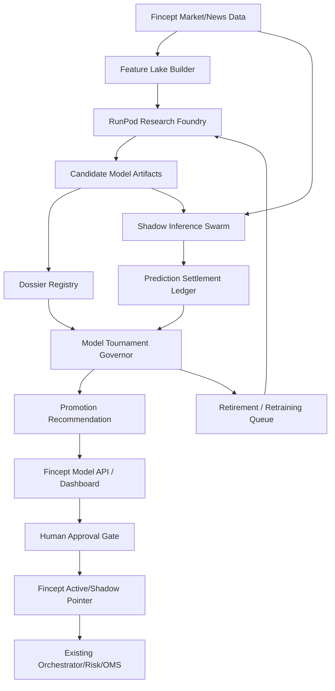

# Fincept Quant Foundry Design

Status: draft for user review  
Date: 2026-06-21  
Repo: `C:\Users\nolan\CascadeProjects\fincept-terminal`  
Primary goal: design a RunPod-hosted hybrid quant ML platform that makes Fincept better at discovering, evaluating, shadow-running, and promoting financial prediction models without bypassing safety controls.

## 1. Executive Intent

Fincept Quant Foundry is a closed-loop quant research and prediction factory. It combines the safest parts of three architectures:

1. **RunPod Research Foundry** trains and evaluates large numbers of model candidates on GPU hardware.
2. **Shadow Inference Swarm** runs live predictions across many models, horizons, symbols, and regimes without placing trades.
3. **Tournament Governor** scores every model against settled outcomes and recommends promotions or retirements.

The performance edge does not come from one giant model. It comes from the loop:

- Better point-in-time labels.
- More diverse model families.
- More brutal out-of-sample evaluation.
- Live shadow measurement before promotion.
- Automatic retirement when edge decays.
- Reproducible model dossiers for every promotion.

The system should be designed to become stronger every day because every prediction, failure, regime shift, and provider anomaly becomes future training evidence.

## 2. Core Claim

The way to outperform ordinary AI trading systems is not to let a black box emit buy and sell commands. The way is to build an automated scientific process around markets:

- Every model prediction becomes settled evidence.
- Every market regime becomes a routing signal.
- Every failed model improves the next search.
- Every live signal stays shadow-only until proven.
- Every promotion has a reproducible receipt.

This gives Fincept a durable moat: model discovery, evidence, governance, and risk control compound together.

## 3. Existing Fincept Anchors

The design should extend the current system instead of creating a parallel platform.

Relevant existing surfaces:

- Feature generation:
  - `services/features/src/features/computer.py`
  - `libs/fincept-db/src/fincept_db/features.py`
- Prediction agents:
  - `services/agents/src/agents/gbm_predictor/`
  - `services/agents/src/agents/news_alpha_predictor/`
  - `services/agents/src/agents/news_impact_agent/`
- Agent contract:
  - `services/agents/src/agents/base.py`
- Backtesting and walk-forward validation:
  - `services/backtester/src/backtester/`
  - `services/backtester/src/backtester/walk_forward.py`
- Model API and training API:
  - `services/api/src/api/routes/models.py`
  - `services/api/src/api/training.py`
- Shadow/news-impact experiment:
  - `experiments/news-impact-model/`
  - `services/api/src/api/routes/news_impact.py`
  - `apps/dashboard/src/components/news-impact/shadow-news-impact-panel.tsx`
- Provider evidence and storage:
  - `libs/fincept-db/src/fincept_db/provider_data.py`
  - `services/api/tests/test_provider_data.py`
- Risk and OMS boundaries:
  - `services/risk/`
  - `services/oms/`
  - `services/orchestrator/`
- Current improvement priorities:
  - `docs/SYSTEM_IMPROVEMENT_REPORT.md`
  - `docs/project-understanding/10-ml-improvement-report.md`
  - `docs/ROADMAP.md`

Important current principle: RunPod can produce models, predictions, dossiers, and recommendations, but it must not bypass Fincept's risk, orchestration, OMS, paper/shadow gates, or promotion rules.

## 4. RunPod Deployment Assumptions

These should be verified against official RunPod docs during implementation, but the design can safely assume:

- RunPod Serverless can host containerized GPU inference workloads behind API endpoints that scale workers based on demand.
- RunPod endpoints expose worker controls such as active workers, max workers, GPUs per worker, idle timeout, execution timeout, job TTL, and cold-start behavior.
- RunPod network volumes can persist model/data artifacts for Serverless workers and are mounted at `/runpod-volume` for Serverless workers.
- Network volumes can reduce cold-start time by avoiding repeated model downloads, but concurrent writes to the same volume require application-level safety.
- For long-running training, dedicated pods or cluster-style GPU jobs may be better than short serverless inference endpoints.

Design implication:

- Use **RunPod Serverless** for request-driven inference and model scoring.
- Use **RunPod Pods or GPU job workers** for long training sweeps, embeddings, large dataset builds, and tournament replay.
- Treat network volumes as read-mostly caches for models and datasets; write canonical artifacts to object storage or Fincept-controlled artifact storage.

## 5. Architecture Overview



Core rule: RunPod systems never publish executable orders. They publish model artifacts, shadow predictions, evaluation receipts, and promotion recommendations.

## 6. Module 1: RunPod Research Foundry

### Purpose

Train, evaluate, and package thousands of candidate models across symbols, horizons, features, regimes, and model families.

### Responsibilities

- Run large GPU/CPU sweeps.
- Train model families.
- Perform walk-forward validation.
- Perform leakage checks.
- Produce calibration reports.
- Produce feature importance and sensitivity reports.
- Package model artifacts and metadata.
- Emit model dossiers into the Dossier Registry.

### Inputs

- Point-in-time feature datasets.
- Historical bars, returns, volume, volatility, spread, and liquidity.
- Historical news/events.
- Provider evidence snapshots.
- Regime labels.
- Corporate actions and market calendar data.
- Existing Fincept model artifacts for baseline comparison.

### Outputs

- Candidate artifacts:
  - model weights
  - model config
  - feature schema
  - label schema
  - training window
  - validation results
  - calibration curves
  - failure notes
  - reproducibility manifest
- Candidate dossier:
  - model card
  - dataset card
  - leakage proof
  - walk-forward proof
  - economic score
  - shadow eligibility recommendation

### Model Families

Start with reliable baselines and progressively add frontier models:

- Gradient boosting:
  - LightGBM
  - CatBoost
  - XGBoost
- Linear and regularized models:
  - ridge/logistic baselines
  - elastic net
  - online linear models
- Time-series neural models:
  - temporal convolutional networks
  - TFT-style attention models
  - patch/time-series transformers
  - sequence-to-distribution models
- Event/news models:
  - financial text encoders
  - event-type classifiers
  - abnormal-return predictors
  - analog retrieval plus learned re-ranker
- Graph models:
  - sector/industry graph models
  - supply-chain exposure graph models
  - cross-asset correlation graph models
- Options and microstructure models:
  - implied-volatility surface models
  - skew/term-structure models
  - order-book imbalance models where data is available
- Meta-labelers:
  - models that decide when another model's signal is worth acting on
  - confidence calibration layers
  - regime-specific routers

### Accuracy Improvements

- Use multi-horizon targets:
  - 1m
  - 5m
  - 30m
  - 1d
  - 5d
  - volatility impact
  - volume impact
  - drawdown impact
- Use cost-aware labels:
  - gross return
  - spread-adjusted return
  - slippage-adjusted return
  - borrow/carry-adjusted return where relevant
  - turnover penalty
- Use leakage-resistant validation:
  - purge windows
  - embargo windows
  - point-in-time feature availability checks
  - no future provider revisions
  - no same-event contamination between train/test
- Use calibration as a first-class target:
  - Brier score
  - reliability curves
  - expected calibration error
  - confidence bucket realized return
- Use economic gates, not just ML metrics:
  - net expected value
  - drawdown contribution
  - turnover
  - capacity
  - hit rate after costs
  - tail loss
  - decay after signal emission

### RunPod Execution Shape

- Training workers run as containerized GPU jobs.
- Each worker receives a dataset manifest and model search config.
- Workers write intermediate artifacts to local scratch or network volume.
- Only validated artifacts are uploaded to canonical artifact storage.
- A coordinator writes a training run receipt.
- Fincept pulls only completed candidate dossiers.

### Hard Guardrails

- Research Foundry never receives broker credentials.
- Research Foundry never writes to order streams.
- Research Foundry never promotes directly to active.
- Research Foundry output is considered untrusted until verified by the Tournament Governor.

## 7. Module 2: Feature Lake Builder

### Purpose

Create point-in-time datasets that are rich enough for frontier models and strict enough to prevent leakage.

### Responsibilities

- Build training datasets from Fincept market data, features, provider data, news, and outcomes.
- Enforce point-in-time joins.
- Track feature availability.
- Track feature freshness.
- Track provider provenance.
- Create embedding stores and graph features.
- Produce dataset manifests for RunPod.

### Dataset Layers

1. **Raw provider layer**
   - immutable source snapshots
   - provider, dataset, request hash, timestamp, and row count
2. **Normalized event layer**
   - normalized bars
   - normalized news/events
   - corporate actions
   - economic calendar
3. **Point-in-time feature layer**
   - price/volatility/cross features
   - regime features
   - liquidity features
   - provider-derived features
4. **Embedding layer**
   - event text embeddings
   - symbol/entity embeddings
   - regime embeddings
   - historical analog vectors
5. **Label layer**
   - multi-horizon abnormal returns
   - volatility/volume impact
   - drawdown and tail-risk impact
   - trade-simulation labels

### Cutting-Edge Feature Ideas

- **Causal market memory graph**
  - Nodes: symbols, events, sectors, macro variables, providers, regimes.
  - Edges: historical co-movement, event response similarity, supply-chain exposure, sector dependence.
  - Use: let models retrieve similar historical causal neighborhoods, not only similar text.

- **Regime embeddings**
  - Learn compact representations of market state using volatility, breadth, macro, liquidity, and cross-asset features.
  - Use: route models by what kind of market we are in.

- **Event analog memory**
  - Retrieve historical events with similar language, symbol profile, liquidity, and regime.
  - Use: explain predictions with "this looks like these prior events."

- **Feature availability score**
  - Track how many expected features are present/defaulted at inference time.
  - Use: block promotion if a model only works when features are complete in training but sparse live.

- **Cross-asset shock features**
  - Measure how shocks propagate from indexes, rates, crypto, FX, commodities, and sector ETFs into individual symbols.
  - Use: distinguish symbol-specific alpha from broad beta moves.

### Outputs

- Dataset manifest:
  - dataset ID
  - train/validation/test windows
  - features included
  - labels included
  - provider versions
  - point-in-time proof
  - hash/checksum
- RunPod-ready dataset shards.
- Fincept dashboard data-readiness receipt.

## 8. Module 3: Shadow Inference Swarm

### Purpose

Run many candidate models live in parallel without giving them trade authority.

### Responsibilities

- Load candidate models from dossiers/artifact registry.
- Consume live feature snapshots or receive feature batches from Fincept.
- Emit shadow predictions only.
- Measure latency, drift, feature availability, and confidence behavior.
- Write prediction records into the settlement ledger.

### Live Prediction Contract

Each shadow prediction should include:

- prediction ID
- model ID
- model family
- artifact version
- symbol
- timestamp
- horizon
- expected return
- p_up
- q10/q50/q90
- confidence
- feature availability score
- regime ID
- source data freshness
- inference latency
- model route/ranker metadata
- no-order-authority assertion

### Accuracy Improvements

- Run ensembles by horizon instead of one universal horizon.
- Run separate model pools for:
  - liquid mega-cap equities
  - mid-cap equities
  - high-volatility equities
  - crypto
  - event-driven symbols
  - low-liquidity symbols
- Use real-time model routing:
  - route by regime
  - route by symbol cluster
  - route by liquidity
  - route by news/event type
  - route by feature availability
- Compare model confidence to realized calibration continuously.
- Detect live feature drift before it becomes PnL drift.

### RunPod Execution Shape

- Use serverless endpoints for bursty inference.
- Keep active workers > 0 only for latency-sensitive inference pools.
- Attach network volumes for read-mostly model caches.
- Use model cache warmup jobs to avoid cold-start penalties.
- Keep inference request/response schemas compact.
- Push only sanitized prediction results back to Fincept.

### Hard Guardrails

- Shadow workers cannot access broker credentials.
- Shadow workers cannot write to order streams.
- Shadow workers cannot call OMS.
- Shadow workers can only emit `shadow_prediction` records.
- Fincept treats all external predictions as untrusted until schema-validated.

## 9. Module 4: Model Tournament Governor

### Purpose

Score, rank, promote, and retire models based on evidence rather than excitement.

### Responsibilities

- Settle predictions against realized outcomes.
- Compare candidates against baselines.
- Score live shadow performance.
- Detect edge decay.
- Recommend promotions.
- Recommend retirement or retraining.
- Produce model tournament receipts.

### Prediction Settlement Ledger

This is the first required foundation.

Every prediction must later be judged against:

- realized return
- abnormal return
- spread/slippage-adjusted return
- volatility impact
- volume impact
- max adverse excursion
- max favorable excursion
- drawdown contribution
- Brier score
- calibration bucket
- confidence bucket realized return
- trade simulation impact if routed through a paper strategy

Ledger fields should include:

- prediction ID
- model ID
- symbol
- horizon
- prediction timestamp
- settlement timestamp
- predicted distribution
- realized distribution or realized outcome
- cost assumptions
- data freshness at prediction time
- feature availability at prediction time
- regime ID
- score fields
- settlement status

### Tournament Score

Do not rank models by AUC alone. Use a composite score:

```text
score =
  out_of_sample_net_edge
  + calibrated_confidence_bonus
  + regime_stability_bonus
  + feature_availability_bonus
  - drawdown_penalty
  - turnover_penalty
  - latency_penalty
  - decay_penalty
  - complexity_penalty
```

Tournament views:

- global leaderboard
- horizon leaderboard
- symbol-cluster leaderboard
- regime leaderboard
- event-type leaderboard
- liquidity-bucket leaderboard
- live-shadow leaderboard
- paper-trade impact leaderboard

### Promotion Gates

A model can be promoted only if it has:

- valid dataset manifest
- point-in-time proof
- leakage check pass
- walk-forward pass
- calibration pass
- feature availability pass
- cost-aware economic pass
- live shadow pass
- no-order-authority proof during shadow
- reproducible model dossier
- human approval

Recommended promotion levels:

1. `candidate`
2. `research-approved`
3. `shadow-approved`
4. `paper-approved`
5. `limited-live-approved`
6. `active`

The first implementation should stop at `shadow-approved` or `paper-approved`.

### Retirement Rules

Models should be automatically flagged when:

- live calibration degrades
- edge decays below baseline
- feature availability falls below threshold
- prediction latency exceeds budget
- drawdown contribution exceeds threshold
- model becomes redundant with a simpler model
- market regime changes and model no longer applies

## 10. Module 5: Dossier Registry

### Purpose

Make every model understandable, reproducible, and governable.

### Responsibilities

- Store model cards.
- Store dataset cards.
- Store training receipts.
- Store evaluation receipts.
- Store promotion decisions.
- Store retirement decisions.
- Expose model status to dashboard/API.

### Dossier Contents

Each model dossier should include:

- model ID
- artifact URI
- artifact hash
- model family
- training code version
- dataset manifest
- feature schema
- label schema
- train/validation/test windows
- leakage checks
- walk-forward results
- calibration results
- economic results
- live shadow results
- model limitations
- known failure regimes
- approval status
- reviewer notes
- rollback pointer

### Dashboard Views

Add operator pages for:

- Model leaderboard.
- Model dossier detail.
- Shadow inference health.
- Prediction settlement ledger.
- Promotion review queue.
- Retirement queue.
- Dataset readiness.
- RunPod worker health.

## 11. Additional Cutting-Edge Performance Modules

These should not be built first, but they are high-upside extensions once the ledger and tournament exist.

### 11.1 Alpha Genome Lab

An automated search system that evolves features, model architectures, and strategy hypotheses.

Core idea:

- Generate many candidate feature/model recipes.
- Test them through walk-forward and shadow gates.
- Keep only recipes with real out-of-sample edge.
- Mutate successful recipes into new variants.

Guardrail:

- Genetic search is extremely prone to overfitting. Every generated recipe must pass stricter holdout, simplicity, and live-shadow gates.

### 11.2 Market World Model

A learned simulator of market regimes and event responses.

Core idea:

- Train models to simulate plausible price/volume/volatility paths conditioned on regime and event type.
- Use the simulator to stress-test strategies before shadow.

Use cases:

- rare-event stress testing
- liquidity shock replay
- macro regime scenario generation
- strategy fragility detection

Guardrail:

- Synthetic scenarios should never replace real out-of-sample proof. They only expose failure modes.

### 11.3 Causal Market Memory Graph

A graph of historical cause/effect relationships between symbols, sectors, events, and regimes.

Core idea:

- Move beyond text similarity.
- Represent how markets historically reacted to similar event-context-symbol combinations.

Use cases:

- explainable analog retrieval
- event impact prediction
- cross-asset contagion modeling
- model routing by causal neighborhood

### 11.4 Mixture-of-Experts Model Router

A meta-model that chooses which expert model to trust.

Inputs:

- regime embedding
- symbol cluster
- liquidity bucket
- volatility state
- event type
- feature availability
- model's recent calibration
- model's recent edge decay

Output:

- weighted blend of expert predictions
- model trust score
- abstain decision

Accuracy benefit:

- A mediocre global model can lose to a router that knows when each specialized model is reliable.

### 11.5 Conformal Prediction Risk Gate

Use conformal methods to produce uncertainty intervals and abstain when the model cannot make a reliable prediction.

Use cases:

- block low-confidence predictions
- widen risk bands during regime shifts
- route uncertain predictions to shadow only

### 11.6 Adversarial Drift Sentinel

A model that tries to detect when the current market is hostile to the active model set.

Signals:

- feature distribution drift
- calibration drift
- provider freshness drift
- symbol liquidity drift
- prediction disagreement spike
- live edge decay

Action:

- lower model trust
- recommend retirement
- force shadow-only mode

### 11.7 Active Learning Queue

Ask the system to prioritize labels/data where uncertainty is high and expected information gain is large.

Examples:

- news events with high disagreement between models
- symbols with sparse history
- regimes where all models degrade
- horizons with high calibration error

### 11.8 Agent Debate for Research, Not Execution

Use AI agents to propose hypotheses, critique results, and generate experiment configs.

Hard rule:

- Agents can propose experiments and explain model behavior.
- Agents cannot approve promotions alone.
- Agents cannot place trades.

## 12. End-to-End Data Flow

### Training Flow

1. Fincept builds point-in-time dataset manifest.
2. Feature Lake Builder exports dataset shards.
3. RunPod Research Foundry receives training job.
4. GPU workers train candidate models.
5. Workers write artifacts and raw metrics.
6. Evaluation worker runs leakage, walk-forward, calibration, and economic tests.
7. Dossier Registry stores accepted candidate dossiers.
8. Tournament Governor ranks candidates.
9. Eligible candidates become shadow-inference candidates.

### Shadow Inference Flow

1. Fincept emits live feature snapshots.
2. Shadow Inference Swarm scores models on RunPod.
3. Swarm returns shadow predictions to Fincept.
4. Fincept validates schemas and writes prediction ledger rows.
5. Settlement worker later attaches realized outcomes.
6. Tournament Governor updates live-shadow leaderboard.
7. Dashboard shows model health, decay, and promotion readiness.

### Promotion Flow

1. Tournament Governor generates promotion recommendation.
2. Dossier Registry freezes promotion packet.
3. Dashboard presents packet for human approval.
4. Human approves promotion to the next level.
5. Fincept updates model pointer.
6. Rollback pointer remains available.
7. Future outcomes continue to update the ledger.

## 13. APIs and Contracts

### Training Job Request

```json
{
  "job_id": "train-2026-06-21-001",
  "dataset_manifest_uri": "s3://fincept-datasets/manifest.json",
  "model_family": "temporal-transformer",
  "search_space": {
    "horizons": ["5m", "30m", "1d"],
    "symbols": ["AAPL", "MSFT"],
    "max_trials": 500
  },
  "validation_policy": {
    "purge_bars": 20,
    "embargo_bars": 10,
    "min_walk_forward_folds": 5
  }
}
```

### Model Artifact Manifest

```json
{
  "model_id": "qf-transformer-aapl-5m-v17",
  "artifact_uri": "s3://fincept-models/qf-transformer-aapl-5m-v17/",
  "artifact_hash": "sha256:...",
  "model_family": "temporal-transformer",
  "feature_schema_hash": "sha256:...",
  "label_schema_hash": "sha256:...",
  "training_code_ref": "git:...",
  "created_at": "2026-06-21T00:00:00Z"
}
```

### Shadow Prediction Response

```json
{
  "prediction_id": "pred-...",
  "model_id": "qf-transformer-aapl-5m-v17",
  "symbol": "AAPL",
  "ts_event": 1782000000000000000,
  "horizon": "5m",
  "expected_return": 0.0017,
  "p_up": 0.61,
  "q10": -0.0022,
  "q50": 0.0011,
  "q90": 0.0048,
  "confidence": 0.72,
  "regime_id": "risk-on-low-vol",
  "feature_availability": 0.98,
  "inference_latency_ms": 38,
  "authority": "shadow-only"
}
```

### Tournament Result

```json
{
  "model_id": "qf-transformer-aapl-5m-v17",
  "status": "shadow-approved",
  "global_rank": 3,
  "baseline_delta": {
    "net_edge_bps": 4.2,
    "brier_improvement": 0.018,
    "drawdown_delta": -0.006
  },
  "promotion_recommendation": "paper-approved",
  "blocking_issues": []
}
```

## 14. Security and Safety Requirements

### Credential Boundary

RunPod workers may receive:

- dataset read token
- artifact write token
- model registry token
- limited callback token

RunPod workers must not receive:

- broker credentials
- OMS credentials
- production database superuser credentials
- unrestricted Redis credentials
- long-lived operator tokens

### Network Boundary

- RunPod may call only allowlisted Fincept endpoints.
- Fincept validates all RunPod payloads.
- All callbacks use signed job IDs and short-lived tokens.
- All artifacts are hash-verified before registration.

### Execution Boundary

- No RunPod worker can write to order streams.
- No RunPod worker can promote a model directly to active.
- No model can bypass Tournament Governor.
- No model can skip the Dossier Registry.

### Data Boundary

- Training datasets must be point-in-time snapshots.
- Provider payloads must be redacted when stored outside Fincept.
- Logs must not contain secrets, raw API keys, or broker account identifiers.

## 15. Performance Design

### Scaling Strategy

- Use dedicated GPU pods for long training sweeps.
- Use serverless GPU endpoints for bursty inference.
- Use network volumes for model cache and warm starts.
- Use object storage as canonical artifact storage.
- Use queue-based scheduling so Fincept can tolerate RunPod outages.

### Hardware Tiers

- Small models and baseline sweeps:
  - lower-cost GPUs or CPU workers
- Large transformer/event models:
  - high-memory GPUs
- Embedding generation:
  - batch GPU workers
- Live inference:
  - low-latency endpoints with warm workers
- Tournament replay:
  - CPU-heavy distributed workers plus optional GPU inference

### Cost Controls

- Budget per experiment family.
- Max trials per training run.
- Early stopping by validation score.
- Kill switches for underperforming sweeps.
- Artifact deduplication by hash.
- Cache embeddings and feature shards.
- Prefer smaller models when scores tie.

### Latency Controls

- Keep live shadow inference separate from bulk research.
- Use warm workers for latency-sensitive pools.
- Route heavy ensemble scoring through async mode.
- Enforce inference timeouts.
- Record queue delay and inference duration in every prediction.

## 16. Accuracy Strategy

### The Accuracy Stack

1. Better labels.
2. Better point-in-time features.
3. Better model diversity.
4. Better calibration.
5. Better model routing.
6. Better live shadow feedback.
7. Better retirement discipline.

### Why This Should Beat Simpler Systems

Most trading AI systems fail because they optimize one part:

- a single model
- a single backtest
- a single signal
- a single prompt
- a single ranking metric

Fincept Quant Foundry optimizes the whole lifecycle:

- data quality
- feature availability
- label correctness
- model diversity
- validation realism
- calibration
- cost-aware economics
- live shadow behavior
- governance
- retirement

The edge comes from making false confidence expensive and making reproducible evidence mandatory.

## 17. Implementation Phases

### Phase 0: Safety Prerequisites

Goal: make sure the current system can safely receive external model artifacts and shadow predictions.

Tasks:

- Apply runtime safety guards to all Fincept service entrypoints.
- Lock down broad file path access in backtest/training surfaces.
- Add provider evidence redaction tests.
- Add durable verification receipts.

Acceptance criteria:

- Runtime safety matrix exists.
- No external worker has order authority.
- Shadow receipt exists for current news-impact lane.
- Backtest path validation is bounded.

### Phase 1: Prediction Settlement Ledger

Goal: every prediction can be judged later.

Tasks:

- Add prediction outcome schema.
- Add settlement worker.
- Add cost/slippage assumptions.
- Add calibration and economic scoring.
- Add dashboard ledger view.

Acceptance criteria:

- Existing GBM/shadow predictions settle into outcome rows.
- Dashboard can show model calibration and realized return by confidence bucket.
- No model promotion can skip settlement evidence.

### Phase 2: Dossier Registry

Goal: every candidate model has a reproducible model card.

Tasks:

- Define model dossier schema.
- Store training/evaluation receipts.
- Link artifacts to dataset manifests.
- Add API/dashboard model dossier views.

Acceptance criteria:

- Existing GBM models can generate dossiers.
- Dossiers include training window, feature schema, label schema, and validation metrics.
- Dossier hash is stable.

### Phase 3: RunPod Research Foundry MVP

Goal: train candidates on RunPod and import artifacts safely.

Tasks:

- Create RunPod training container.
- Define training job request schema.
- Export point-in-time dataset shards.
- Train first candidate family.
- Import artifact and dossier.

Acceptance criteria:

- One RunPod-trained model artifact imports into Fincept.
- Artifact hash is verified.
- Model remains shadow-only.
- Local tests verify schema compatibility.

### Phase 4: Shadow Inference Swarm MVP

Goal: run RunPod-hosted models live in shadow mode.

Tasks:

- Create RunPod inference container.
- Add shadow prediction endpoint.
- Add Fincept callback validator.
- Add feature availability and latency metadata.
- Write predictions to settlement ledger.

Acceptance criteria:

- RunPod model emits shadow predictions.
- Fincept validates and stores them.
- Predictions cannot reach order streams.
- Tournament can score settled shadow outcomes.

### Phase 5: Tournament Governor MVP

Goal: rank models and recommend promotions.

Tasks:

- Implement leaderboard scoring.
- Add baseline comparisons.
- Add regime/horizon/symbol leaderboard slices.
- Add decay detection.
- Add promotion recommendation packets.

Acceptance criteria:

- Tournament ranks at least existing GBM, news-alpha, and one RunPod model.
- Promotion packet requires dossier and settlement evidence.
- Retirement flags appear when performance decays.

### Phase 6: Frontier Performance Modules

Goal: add high-upside research after the evidence loop is working.

Tasks:

- Add Mixture-of-Experts router.
- Add causal market memory graph.
- Add conformal prediction gate.
- Add adversarial drift sentinel.
- Add world-model scenario forge.
- Add alpha genome search.

Acceptance criteria:

- Each frontier module has a shadow-only evaluation path.
- Each module can be disabled without breaking core Fincept.
- Each module must beat the existing baseline in tournament evidence before promotion.

## 18. Testing Plan

### Unit Tests

- Dataset manifest validation.
- Artifact manifest validation.
- Dossier schema validation.
- Prediction settlement math.
- Calibration metrics.
- Tournament scoring.
- RunPod callback signature validation.
- Feature availability scoring.

### Integration Tests

- Export dataset -> train mock model -> import artifact.
- RunPod mock inference -> Fincept callback -> prediction ledger.
- Prediction ledger -> settlement worker -> tournament score.
- Dossier -> dashboard/API model detail.

### Security Tests

- Reject unsigned RunPod callbacks.
- Reject callbacks with order fields.
- Reject artifacts with wrong hash.
- Reject models missing dossier fields.
- Reject provider evidence containing token-shaped strings or raw paths.
- Reject external worker attempts to write order streams.

### Performance Tests

- Inference latency under target worker count.
- Queue delay under burst.
- Dataset export time.
- Tournament replay time.
- Feature-lake build time.
- Network-volume cold/warm model load time.

### Suggested Existing Commands

From this repo, current relevant validation commands include:

```powershell
npm run test:shadow-news-impact
npm run test:source-health
npm run test:strategy-readiness
pnpm --dir apps/dashboard exec tsc --noEmit --pretty false
uv run pytest services/api/tests/test_news_impact.py -q
uv run pytest services/agents/tests -q
uv run pytest services/backtester/tests -q
uv run pytest services/features/tests -q
```

## 19. Operational Monitoring

Track:

- RunPod worker health.
- RunPod queue delay.
- GPU utilization.
- training cost per accepted candidate.
- inference cost per 1,000 predictions.
- model load time.
- model inference latency.
- prediction settlement lag.
- calibration drift.
- feature availability drift.
- provider freshness drift.
- tournament rank changes.
- promotion/retirement events.

Alert when:

- shadow inference stops.
- settlement lag exceeds threshold.
- model calibration drops below threshold.
- RunPod callback failures spike.
- artifact hash validation fails.
- feature availability drops.
- active model underperforms baseline.

## 20. Data and Artifact Storage

Recommended storage layout:

```text
datasets/
  <dataset_id>/
    manifest.json
    train/
    validation/
    test/
    point_in_time_proof.json

models/
  <model_id>/
    artifact_manifest.json
    weights/
    feature_schema.json
    label_schema.json
    inference_config.json

dossiers/
  <model_id>/
    model_card.md
    dataset_card.md
    leakage_report.json
    walk_forward_report.json
    calibration_report.json
    economic_report.json
    promotion_packet.md

receipts/
  training/
  inference/
  tournament/
  promotion/
  retirement/
```

Canonical artifacts should be stored outside ephemeral workers. RunPod network volumes should be used as caches and staging storage, not the only source of truth.

## 21. Repo Integration Plan

Likely future files/modules:

```text
services/quant_foundry/
  src/quant_foundry/
    dataset_manifest.py
    artifact_manifest.py
    dossier.py
    settlement.py
    tournament.py
    runpod_client.py
    callbacks.py
    schemas.py
  tests/

services/api/src/api/routes/quant_foundry.py

apps/dashboard/src/app/quant-foundry/
apps/dashboard/src/app/models/[name]/page.tsx
apps/dashboard/src/app/receipts/page.tsx

reports/quant-foundry/
docs/quant-foundry/
```

Integration with existing services:

- Reuse `fincept_core.schemas` where possible.
- Reuse feature service outputs where possible.
- Reuse model API patterns.
- Reuse shadow-only news-impact discipline.
- Reuse provider-data ledger for provenance.
- Reuse backtester and walk-forward validation where possible.

## 22. Risks and Mitigations

### Risk: Overfitting at industrial scale

- Mitigation: harder holdouts, live shadow proof, simplicity penalties, and embargo/purge validation.

### Risk: RunPod worker compromise or credential leak

- Mitigation: no broker credentials, short-lived scoped tokens, signed callbacks, artifact hash validation.

### Risk: Black-box model confidence

- Mitigation: dossiers, calibration, analog explanations, feature importance, and abstain rules.

### Risk: Training cost explosion

- Mitigation: budgets, early stopping, trial pruning, artifact dedupe, and tournament thresholds.

### Risk: Model promotion gets politicized or emotional

- Mitigation: no dossier, no promotion. No settlement evidence, no promotion.

### Risk: Live market regime changes suddenly

- Mitigation: drift sentinel, regime router, automatic demotion to shadow-only, and rollback pointers.

### Risk: Synthetic/world-model scenarios create false confidence

- Mitigation: scenarios are stress tests only; real out-of-sample and live shadow evidence remain mandatory.

## 23. First Build Slice

The first implementation should not start with RunPod. It should start with the evidence loop that RunPod will feed.

Recommended first slice:

1. Prediction Settlement Ledger.
2. Dossier schema.
3. Tournament scoring skeleton.
4. Mock RunPod artifact import.
5. Shadow-only callback validator.

Why:

- It creates the scoreboard before adding more players.
- It makes future GPU scale useful instead of noisy.
- It preserves the whole system's safety boundaries.

## 24. Definition of Done for MVP

MVP is complete when:

- One existing Fincept model has a dossier.
- One mock RunPod model has an imported artifact and dossier.
- Both models emit shadow predictions.
- Predictions settle into outcome rows.
- Tournament ranks both models against a baseline.
- Dashboard can show dossier, settlement, and tournament status.
- No RunPod path can place orders.
- Promotion requires human approval.
- All receipts are reproducible.

## 25. Final Recommendation

Build Fincept Quant Foundry as a hybrid platform:

1. Start with the settlement ledger and dossier registry.
2. Add RunPod Research Foundry for scalable model generation.
3. Add Shadow Inference Swarm for live non-trading proof.
4. Add Tournament Governor for promotion and retirement.
5. Add frontier modules only after the core evidence loop works.

The winning design is not "one AI model that trades." It is an evidence machine that turns data, models, predictions, failures, and market regimes into a compounding research advantage.
